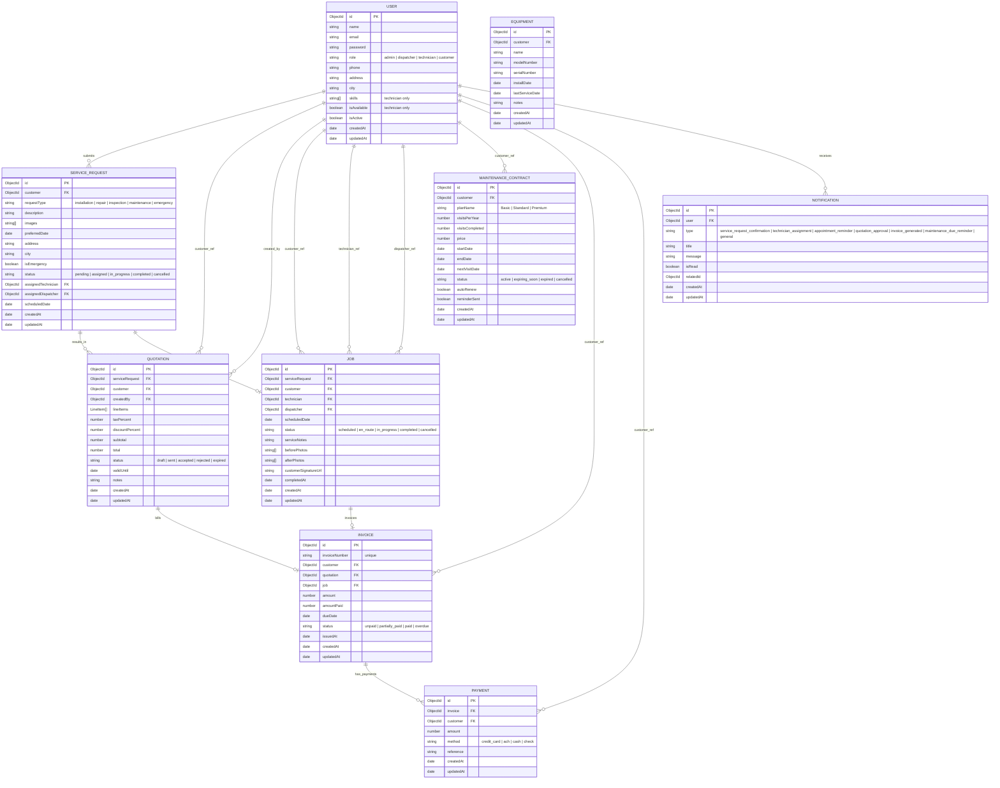

# Entity-Relationship (ER) Diagram

Below is the entity-relationship schema for the ServiceFlow™ HVAC Service Management System, showing database entities, fields, data types, and primary/foreign key connections.

